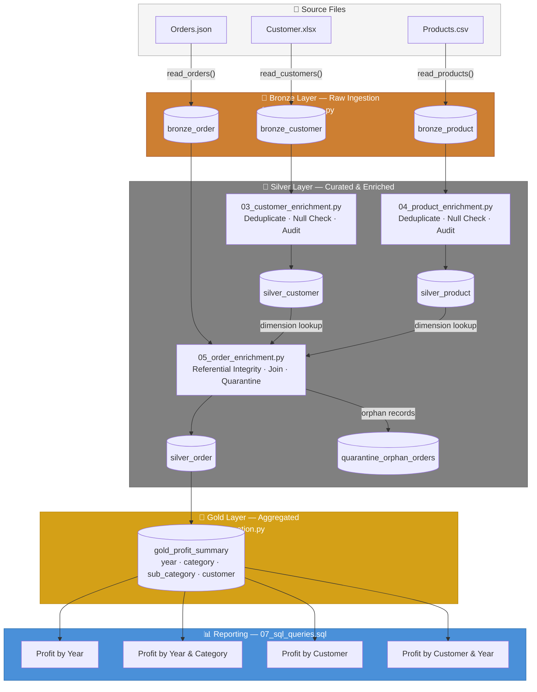

# Pipeline Architecture

## Medallion Architecture Overview

The pipeline follows the **Bronze → Silver → Gold** medallion pattern on Databricks with Delta Lake as the storage format. Each layer is implemented as a dedicated notebook with a single responsibility.

`01_ddl_setup.py` also creates semantic views for consumption:
- `vw_silver_customer`
- `vw_silver_product`
- `vw_silver_order`
- `vw_gold_profit_summary`

---

## Layer Responsibilities

### Bronze — Raw Ingestion (`02_raw_ingestion.py`)

| Table | Source | Key Validations |
|-------|--------|-----------------|
| `bronze_customer` | `Customer.xlsx` | Non-empty, required columns (`customer_id`) |
| `bronze_product` | `Products.csv` | Non-empty, required columns (`product_id`) |
| `bronze_order` | `Orders.json` | Non-empty, required columns (`order_id`, `customer_id`, `product_id`) |

- Column names sanitised to snake_case at read time.
- Explicit Spark schemas enforced for Products (CSV) and Orders (JSON).
- Audit columns (`load_timestamp`, `load_type = 'BATCH'`) added before write.
- Written in `append` mode to preserve raw batch history.

---

### Silver — Curated & Enriched

#### Customer Enrichment (`03_customer_enrichment.py`)

- Reads latest `bronze_customer` batch using `max(load_timestamp)`.
- Deduplicates on `customer_id` via `enrich_customer()` — raises `ValueError` on empty input.
- Validates: no nulls on `customer_id`, no duplicates on `customer_id`.
- Upserts into `silver_customer` using key `customer_id` (idempotent merge).

#### Product Enrichment (`04_product_enrichment.py`)

- Reads latest `bronze_product` batch using `max(load_timestamp)`.
- Deduplicates on `product_id` via `enrich_product()` — raises `ValueError` on empty input.
- Validates: no nulls on `product_id`, no duplicates on `product_id`.
- Upserts into `silver_product` using key `product_id` (idempotent merge).

#### Order Enrichment (`05_order_enrichment.py`)

- Reads latest `bronze_order` batch using `max(load_timestamp)` + `silver_customer` + `silver_product`.
- Checks referential integrity on `customer_id` and `product_id` before joining.
- Orphan orders (unmatched keys) are upserted into `quarantine_orphan_orders` by `order_id` and excluded from the curated dataset.
- Enriches orders via `enrich_orders()` — broadcast joins on dimension tables — raises `ValueError` on empty input.
- Validates: no nulls on `order_id`.
- Upserts into `silver_order` using key `order_id` (idempotent merge).

---

### Gold — Aggregated (`06_aggregation.py`)

- Reads `silver_order`.
- Derives `year` from `order_date`.
- Aggregates total profit (rounded to 2 d.p.) grouped by `year`, `category`, `sub_category`, `customer_name`.
- Overwrites `gold_profit_summary` each run (full recompute from curated base).

---

### Reporting (`07_sql_queries.sql`)

Ad-hoc SQL queries against the Silver and Gold tables:

1. Profit by year
2. Profit by year and category
3. Profit by customer
4. Profit by customer and year

For consumer-facing access, `vw_gold_profit_summary` can be used as a stable Gold semantic layer.

---

## Delta Table Inventory

| Table | Layer | Written by |
|-------|-------|-----------|
| `bronze_customer` | Bronze | `02_raw_ingestion.py` |
| `bronze_product` | Bronze | `02_raw_ingestion.py` |
| `bronze_order` | Bronze | `02_raw_ingestion.py` |
| `silver_customer` | Silver | `03_customer_enrichment.py` |
| `silver_product` | Silver | `04_product_enrichment.py` |
| `silver_order` | Silver | `05_order_enrichment.py` |
| `quarantine_orphan_orders` | Silver | `05_order_enrichment.py` |
| `gold_profit_summary` | Gold | `06_aggregation.py` |

All tables reside in catalog `teo_dev`, schema `sales_analytics`.
